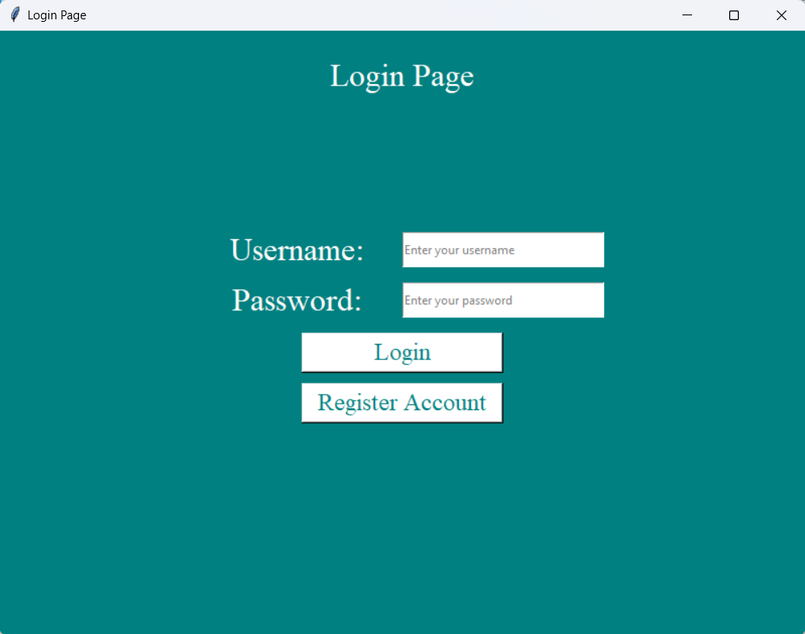
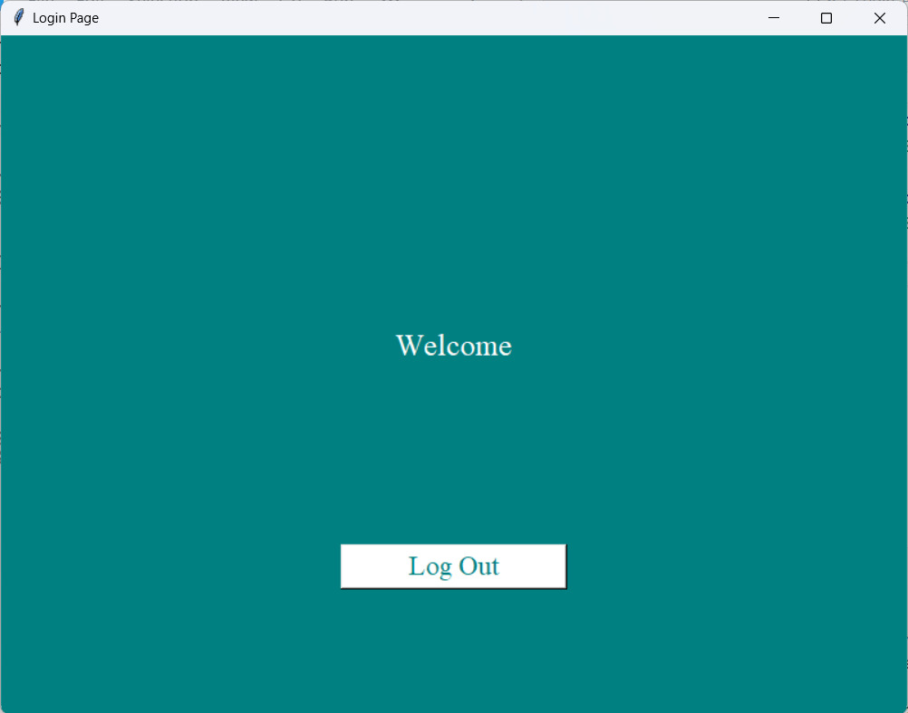
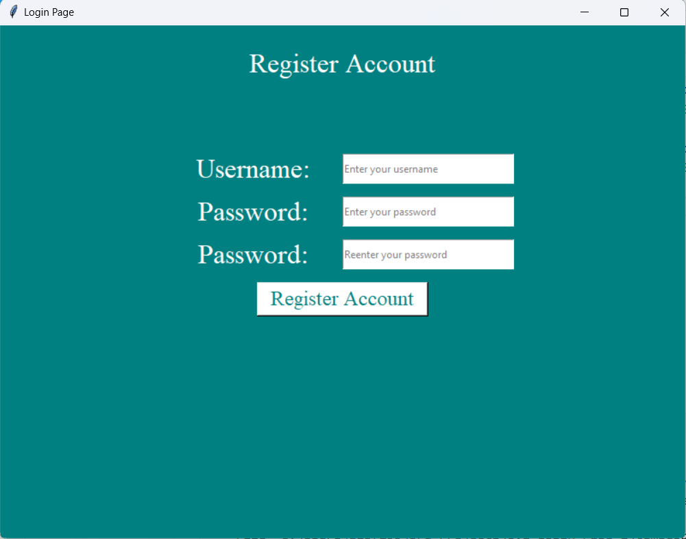
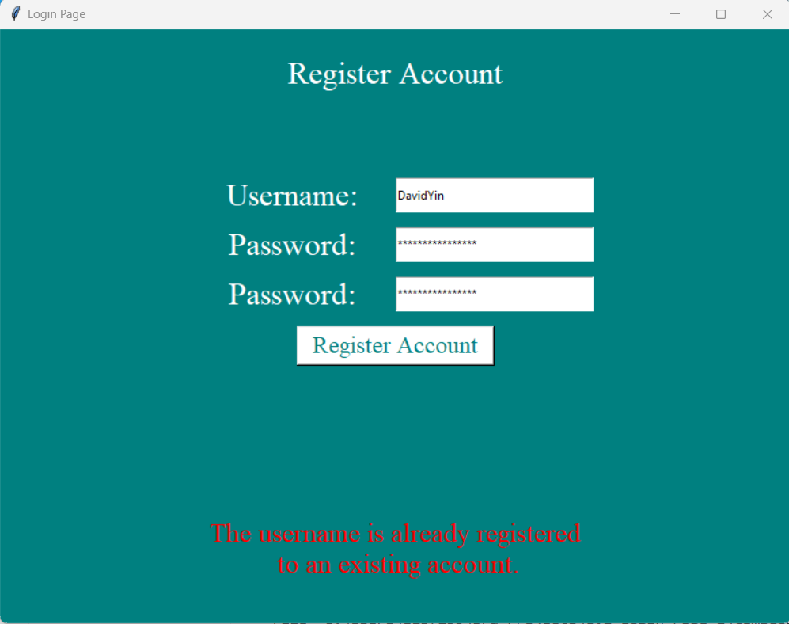

# 6.1-Login-Page

#### Objective:
You will create a login and registration system using Python and Tkinter. The system will validate the user's login credentials and allow new users to register with specific password requirements. Upon successful login, the user will be taken to a new frame that displays a greeting.

---
1. **Build the Login Page**:
   - Create a Tkinter window with two entry widgets for username and password.
   - Add a button for login and another for registering a new user.
   - If the login fails, display an error message below the entries.
   - If the login is successful, take the user to a new frame that displays a personalized greeting.

2. **Build the Registration Page**:
   - Create a new window for registration.
   - Add fields for a new username, new password, and password confirmation.
   - Validate that the password meets the requirements:
     - At least one special character.
     - At least one number.
     - At least one lowercase letter
     - At least one uppercase letter
     - At least 10 characters.
   - If the username already exists, prompt the user to choose a different one.
   - If the password does not meet the requirements, prompt the user to enter a new password.
   - If the registration is successful, return to the login page.

3. **Test Cases**:
   - Test login with a valid username/password.
   - Test login with an incorrect password.
   - Test the registration process with invalid usernames or passwords.
   - Ensure that the password meets all security requirements.
   - Verify that a successful login takes the user to the greeting page.
  
   
   
   
   
   
   
   

